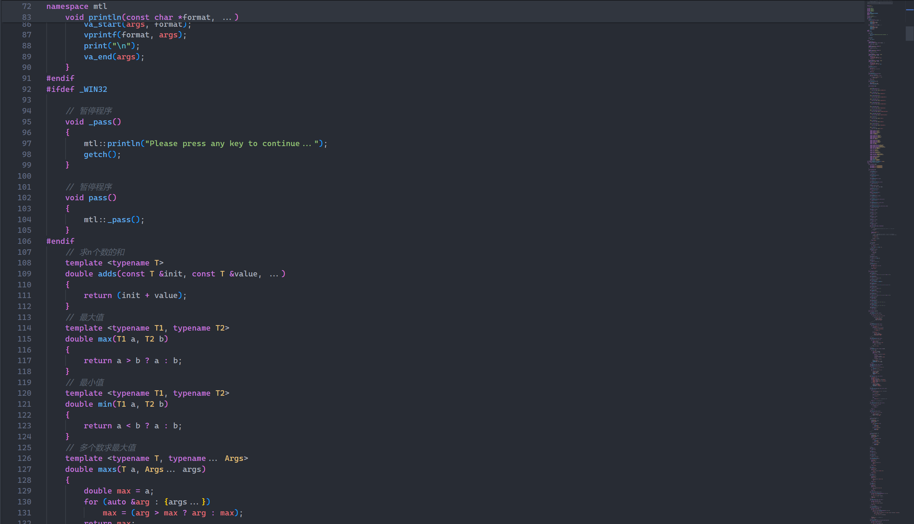
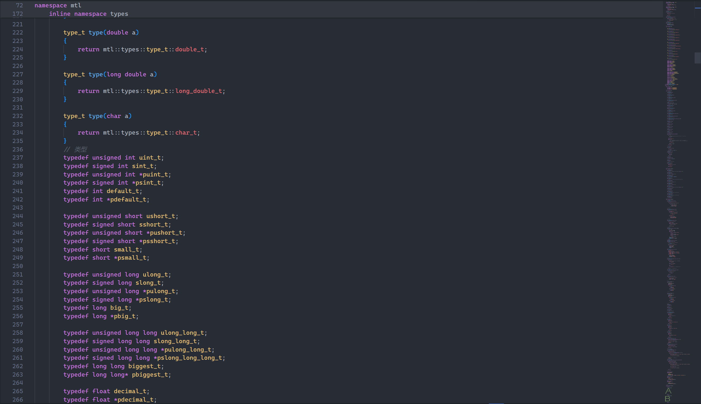
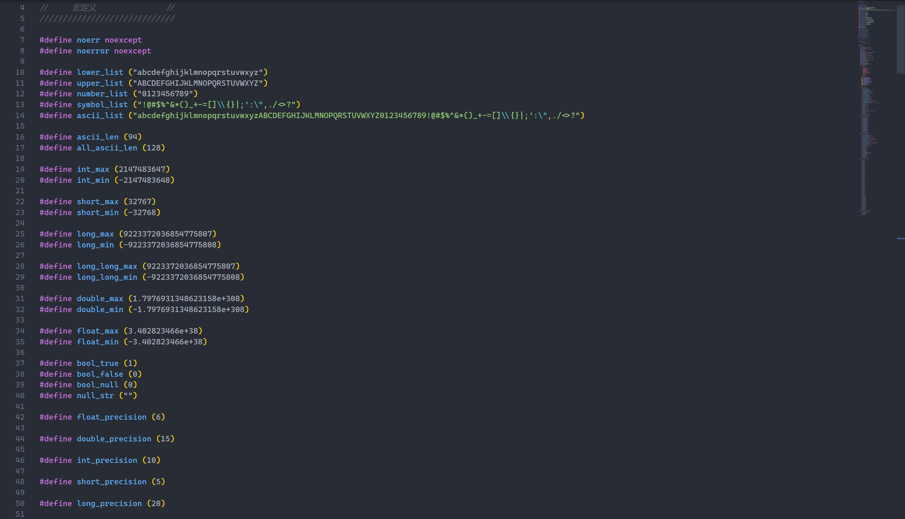
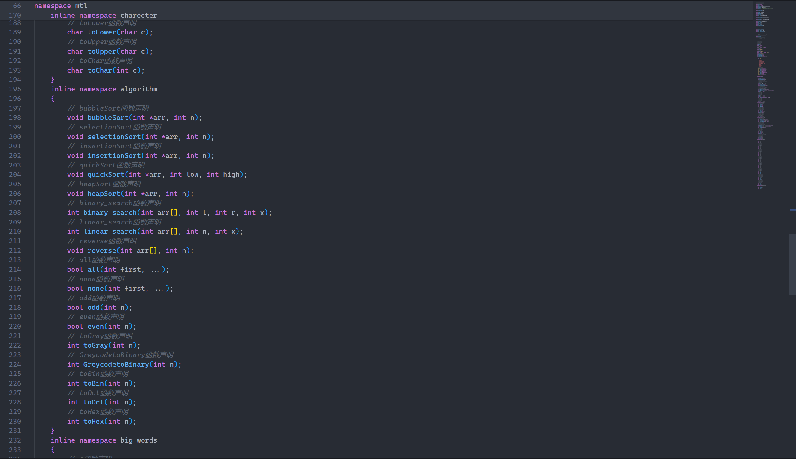

# preview

# download

- `git clone https://github.com/neverforward/MTL.git`[^1]
- [github](https://github.com/neverforward/MTL)

[^1]: please install git

# author

- [github@neverforward](https://github.com/neverforward)
